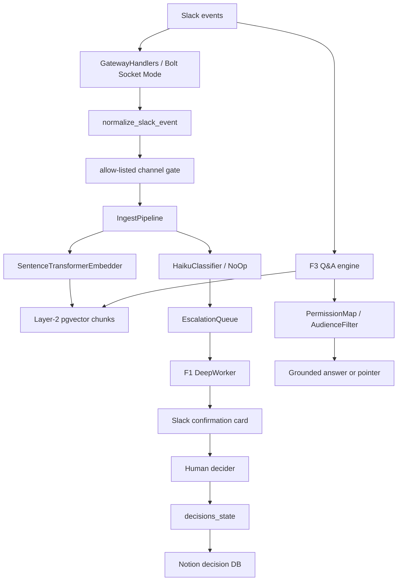

# Alex Case Study

本文目标有三件事:

1. 给出一套自上而下的 AI Agent 学习框架。
2. 把这套框架映射到 `ai-chief-of-staff` / Alex 项目。
3. 解释 `agentic AI` 和 `AI agent` 的区别,并判断 Andrew Ng 的 Agentic AI 课程如何放进学习路线。

日期基准: 2026-06-01。AI agent 领域变化很快,模型/SDK/API 名称要按官方文档复核。

---

## 1. 依据: 不是单一标准,而是多家官方框架的交集

目前没有一个全行业唯一的"AI Agent 理论框架"。更可靠的做法是把几家官方资料的共同结构抽出来:

| 来源 | 官方框架重点 | 对本教程的贡献 |
|---|---|---|
| OpenAI, [A practical guide to building agents](https://openai.com/business/guides-and-resources/a-practical-guide-to-building-ai-agents/) | agent = model + tools + instructions; run loop; single-agent / multi-agent orchestration; guardrails | agent 的最小构件、运行循环、何时拆多 agent |
| OpenAI, [Agents SDK docs](https://developers.openai.com/api/docs/guides/agents) | orchestration, guardrails, state, observability, evals, tools | 工程化能力面:运行、追踪、评测、安全 |
| Anthropic, [Building effective agents](https://www.anthropic.com/engineering/building-effective-agents) | 区分 workflows 和 agents; 从 augmented LLM 到 workflows 再到 agents; 简单可组合优先 | agentic system 的分类学; 不要过早复杂化 |
| Microsoft Learn, [Agent architecture components](https://learn.microsoft.com/en-us/agents/architecture/components-of-agent-architecture) | client, infrastructure, orchestrator, model, catalog, tool calling, semantic index, MCP, responsible AI | 企业级架构分层 |
| Google ADK, [Technical Overview](https://adk.dev/get-started/about/) | Agent, Tool, Callbacks, Session/State, Memory, Artifact, Code Execution, Planning, Runner, Event | 开发原语和运行时对象模型 |
| DeepLearning.AI, [Agentic AI](https://www.deeplearning.ai/courses/agentic-ai) | reflection, tool use, planning, multi-agent workflows, external tools, evaluation, optimization | 学习路线中的模式训练和代码练习 |

把这些资料合并后,一个科学的 top-down 框架可以写成:

```text
任务/环境
  -> agentic system 是否必要
  -> orchestration 形态
  -> agent loop
  -> model / tools / memory / state / policy
  -> guardrails / permissions / human gates
  -> evaluation / observability / iteration
```

---

## 2. 核心定义

### 2.1 Agentic AI

`Agentic AI` 是一种系统范式,不是某一个对象。它指用 LLM 参与多步骤任务执行的系统形态,常见特征是:

- 不只是单次 prompt-response,而是多步流程。
- 可以调用外部工具,例如数据库、API、浏览器、代码执行、Slack、Notion。
- 可能包含规划、反思、重试、状态管理、多人/多 agent 协作。
- 可以是完全确定性的 workflow,也可以包含模型动态决策。

Anthropic 的定义很实用: `agentic systems` 包含两类:

- `workflow`: LLM 和工具沿着预定义代码路径被编排。
- `agent`: LLM 动态决定自己的过程和工具使用。

所以,所有 AI agent 都属于 agentic AI 系统,但不是所有 agentic AI 系统都是 AI agent。

### 2.2 AI Agent

`AI agent` 是 agentic AI 系统里的一个具体执行主体。它通常具备:

- `Goal`: 当前目标或任务。
- `Context/State`: 当前会话、历史、环境观测。
- `Policy/Model`: 决策器,通常是 LLM 或 LLM + rules。
- `Tools/Actions`: 可执行动作,如读 DB、发 Slack、写 Notion、跑浏览器。
- `Memory`: 短期状态和长期知识。
- `Loop`: observe -> reason/plan -> act -> observe -> stop。
- `Guardrails`: 权限、安全、预算、人类确认。

形式化地看,AI agent 接近 POMDP:

```text
hidden world state S
observation O_t
belief/context B_t
action A_t
tool/environment response O_{t+1}
objective/reward/cost constraint
```

LLM agent 的难点是:真实世界状态不可全知,工具有副作用,输出不是完全确定的,权限边界又必须确定。

---

## 3. Top-Down Tutorial

### Chapter 0: 从任务判断是否需要 agent

先问:这个问题是否真的需要 agent?

适合 agent:

- 任务步骤数不固定。
- 需要根据中间结果调整下一步。
- 工具选择依赖语义判断。
- 环境状态会变化。
- 人类不想手写所有 if/else。

不适合 agent:

- 规则明确、低容错、强合规流程。
- 单次 RAG 就能回答。
- 任务只需要固定 API 调用。
- 工具副作用高,但缺乏确认机制。

对应到 Alex:

- Slack 全量消息进入后,每条都跑完整 agent loop 是错误设计。
- Alex 采用两车道:所有消息走确定性快速通道;只有少数候选进入深处理。
- 这是正确的 agentic system 设计:能用 workflow 解决的地方不用 agent。

练习:

1. 写出你的任务集合: F1 决策捕获、F2 矛盾检测、F3 Q&A、F4 委派、F5 Notion action、F6 backfill。
2. 给每个任务标注: deterministic workflow / LLM workflow / true agent。
3. 标注每个任务允许的副作用: read-only / propose / write-after-human-confirm / autonomous write。

### Chapter 1: 系统边界和环境

Agent 不是孤立模型,而是环境中的控制系统。

需要定义:

- 用户入口: Slack app mention, DM, channel message, interactive button。
- 环境: Slack workspace, Notion, Postgres/pgvector, Anthropic API, future Claude Agent SDK, QA browser environment。
- 权限边界: source channel, asker/audience, bot membership, human approval rights。
- 退出条件: answer returned, card posted, task acked, Notion synced, pointer fallback, max retry exceeded。

Alex 映射:

- `src/aipm/gateway/bolt_app.py`: Slack event gateway。
- `src/aipm/main.py`: 组装入口,启动 Socket Mode 和后台 worker。
- `aipm_kernel.permissions`: 权限快照和 `can_view`。
- `src/aipm/qa/engine.py`: F3 read-only Q&A workflow。

练习:

- 画出 `source event -> state change -> external output`。
- 每个输出都标注是否可逆。
- 每个状态写入都标注谁有 authority。

### Chapter 2: Orchestration, 不要把所有东西都塞进 agent loop

官方资料共同点:先选 orchestration,再谈 agent。

常见形态:

| 形态 | 决策权在哪里 | 适合场景 | 风险 |
|---|---|---|---|
| Deterministic workflow | 代码 | 权限、支付、审批、固定管道 | 灵活性低 |
| LLM classifier/router | 小模型 + schema | 分流、标签、优先级 | 误分流 |
| Augmented LLM | 单次模型 + tools/RAG | 问答、总结、抽取 | 无长期自主性 |
| Plan-execute | planner + executor | 多步任务 | 计划漂移 |
| ReAct loop | LLM 循环选工具 | 信息探索、调试 | 成本和不可预测性 |
| Evaluator-optimizer | 生成器 + critic | 写作、代码、QA | 循环成本 |
| Multi-agent manager | manager 调 specialist | 工具/领域复杂 | 协调开销 |
| Decentralized handoff | agents 互相交接 | 角色自治 | 状态一致性难 |

Alex 当前选择:

- Gateway/ingest/permissions: deterministic workflow。
- Haiku classifier: LLM classifier/router。
- F1 confirmation: deterministic human-in-the-loop workflow。
- F3 Q&A: retrieval-augmented generation workflow, read-only。
- Future QA agent / PM agent: 更接近 true agent,因为会规划浏览器操作或项目工作。

练习:

- 把 F1-F6 分别放进上表。
- 对每个模块写一句:为什么不用更强 agent?

### Chapter 3: Agent loop

标准 agent loop:

```text
observe -> update context -> decide/plan -> call tool -> observe result -> decide next -> stop
```

工程上要拆成:

- `Input normalizer`: 把 Slack/HTTP/UI 事件变成内部事件。
- `State store`: 任务状态、conversation state、checkpoint。
- `Planner/Policy`: LLM 或规则选择下一步。
- `Tool executor`: 执行外部动作。
- `Verifier`: 校验输出和权限。
- `Stop condition`: final answer, structured output, max turn, error, human needed。

Alex 里最接近 loop 的地方:

- F1 deep worker: claim task -> derive tier -> identify initiator/decider -> create state -> post card -> ack。
- F3 Q&A: embed -> retrieve L1/L2 -> permission filter -> generate -> pointer fallback。
- Future Claude Agent SDK core: 应该只承载需要动态工具选择的任务,不要取代整套确定性外壳。

练习:

- 写出 F3 的 loop 版本,再写出现有 workflow 版本。
- 比较两者:权限可验证性、成本、延迟、失败模式。

### Chapter 4: Tools and actions

工具不是函数列表,而是 action surface。每个工具必须有风险等级。

工具分级:

| 等级 | 例子 | 策略 |
|---|---|---|
| Read-only | vector search, Notion read, Slack history read | 可自动 |
| Write reversible | Slack reply, ephemeral message, draft card | 可自动但要日志 |
| Write authoritative | Notion decision record, task creation | 人类确认 |
| High risk | permission changes, private data export, destructive DB writes | 默认禁止或双确认 |

Alex 当前设计很好的一点:

- 决策台账是权威数据,必须经过 F1 confirmation card。
- Q&A 是 read-only,可以自动。
- `Source_Channel` / `channel_id` 保持为权限判断依据。
- `project/scope` 只做归属/查询,不做权限。

练习:

- 为每个 tool 写 `risk`, `who can call`, `required confirmation`, `audit log`, `rollback`。
- 给未来 QA browser tool 单独建风险表: read page / click / login / submit form / destructive action。

### Chapter 5: Memory

Agent memory 要分层,否则会污染权威事实。

建议分四类:

| 类型 | 内容 | 写入权 | 用途 |
|---|---|---|---|
| Session state | 当前对话、当前任务 | runtime | 短期连贯性 |
| Semantic memory | Slack chunks, embeddings | 自动收集 | 检索和问答 |
| Authoritative memory | confirmed decisions | 人类确认后写 | 决策、矛盾检测 |
| Operational memory | bot 自身偏好/经验 | 可自动,但隔离 | 自我调优 |

Alex 已经有清晰分层:

- Layer 1: Notion decision ledger, human-auditable, authority。
- Layer 2: pgvector conversation chunks, automatic, non-authoritative。
- Layer 3: operational memory, PRD 中规划,要和 Layer 1 硬隔离。

最重要的不变量:

```text
semantic memory 可以自动写;
authoritative memory 必须 human-gated;
operational memory 不能写 authoritative memory。
```

练习:

- 为每一类 memory 写污染风险。
- 写一个"错误记忆如何撤销"流程。
- 给每条 memory 加 `source`, `created_at`, `confidence`, `authority`, `visibility_channel_id`。

### Chapter 6: RAG and evidence

RAG 不是"把检索结果塞进 prompt",而是证据管道。

工程契约:

- 查询前可预过滤,但查询后必须再权限过滤。
- 检索结果必须带 source id。
- 生成器必须只从 source 作答。
- 无证据时返回 pointer/fallback,不要编。
- citation accuracy 要作为测试指标。

Alex 映射:

- `src/aipm/qa/engine.py`: L1/L2 retrieve 后做 audience filter。
- `src/aipm/qa/generation.py`: 要求 grounded JSON 和 citations,无 citations 则拒答。
- PRD K3: Q&A 引用准确度 >= 90%。

练习:

- 建 30-50 个代表性问题集。
- 每个问题标注 expected source。
- 评测 citation 是否真的支持 answer。

### Chapter 7: Planning and reflection

学习 Agentic AI 常会先接触四个设计模式:

- Reflection: 生成后自评和修正。
- Tool use: 模型调用外部工具。
- Planning: 拆任务、排序、执行。
- Multi-agent: 多角色协作。

这些模式有用,但不能替代系统设计。

对 Alex 的判断:

- F1 捕获不应靠 reflection 自动写权威库,必须 human gate。
- F3 Q&A 不一定需要 planning,单次 RAG workflow 更可控。
- QA browser agent 可能需要 planning,因为页面探索步骤不固定。
- F2 矛盾检测可用 evaluator pattern,但公开发言前要阈值和权限门。
- 多 agent council 可用于设计审查,但生产路径要有单写者和状态一致性。

练习:

- 找一个模块刻意不用 agent,写出原因。
- 找一个模块必须用 agent,写出固定 workflow 为什么不够。

### Chapter 8: Guardrails and permissions

安全不是一个 prompt,而是一组确定性机制。

至少需要:

- Authentication: 谁在调用。
- Authorization: 他能看什么、做什么。
- Data boundary: 内容来自哪里。
- Tool risk policy: 工具是否可自动执行。
- Human gate: 哪些动作需要确认。
- Output validation: schema / citation / PII / no unsupported claims。
- Audit log: 谁触发、谁批准、写了什么。
- Fail-closed: 权限未知或过期时拒绝。

Alex 关键护栏:

- `can_view` 未知频道返回 false。
- 权限快照过期返回 false。
- 权限基于 immutable `channel_id`,不是 `project`。
- F1 card 只有 current_decider 可以确认。
- Notion write 是 best-effort,状态库先记录 confirmed,retry worker 后补。

练习:

- 写一个 adversarial test: 无权限用户问私密频道决策。
- 写一个 stale permission test: permission snapshot 超过 max_age。
- 写一个 wrong approver test: 非 decider 点击 F1 confirm。

### Chapter 9: Evaluation

Agent 评测要覆盖任务成功和系统安全。

指标分层:

| 层 | 指标 |
|---|---|
| 模型输出 | classification precision/recall, structured output validity |
| 任务成功 | decision capture coverage, Q&A correctness, task routing acceptance |
| 安全 | permission leak count, unauthorized tool call count, human-gate bypass count |
| 系统 | latency, cost, queue depth, retry age, stale permission age |
| 运营 | false alarm rate, user ignore rate, approval rate |

Alex 已有 KPI:

- K1 contradiction precision。
- K2 decision capture coverage。
- K3 Q&A citation accuracy。
- K4 delegation acceptance。
- K5 bot engagement。

建议补充:

- `permission_leak = 0` 作为硬门,不是平均指标。
- `unsupported_answer_rate`。
- `oldest_unsynced_notion_age`。
- `queue_oldest_pending_age`。
- `classifier_schema_reject_rate`。
- `human_gate_bypass_attempts`。

练习:

- 给每个 F1-F6 功能定义 5 条黄金测试。
- 把失败分成: model error / retrieval error / permission error / tool error / workflow state error / UX error。

### Chapter 10: Observability and iteration

没有 trace,agent 无法调。

最小观测字段:

- input event id: channel_id, msg_ts, thread_ts。
- user/audience。
- model name, prompt version, output schema version。
- retrieved source ids。
- filtered source ids and denial reasons。
- tool calls and latency。
- state transitions。
- human approvals。
- final outcome。

Alex 已有一些方向:

- worker heartbeat。
- queue depth。
- Notion outage age。
- kernel version startup log。

建议下一步:

- 给 F1/F3 建统一 trace id: `channel_id:msg_ts`。
- 所有 LLM 调用带 `prompt_version`。
- 把 permission filter drops 计数化。
- 把 citations 和 source ids 写进 QA 日志。

---

## 4. Alex / ai-chief-of-staff 架构拆解

### 4.1 产品层定位

Alex 是一个 Slack 常驻 PM agentic system,目标是:

- 组织记忆。
- 决策捕获。
- 矛盾检测。
- 请求 triage。
- 多 agent / worker 协作。

更精确地说:

```text
Alex = deterministic shell + LLM workflows + future agent runtime + shared kernel
```

当前代码已经实现了大量 deterministic shell 和 LLM workflow。完整 Claude Agent SDK "大脑"在 ADR/PRD 中是目标架构,但 `pyproject.toml` 当前依赖是 `anthropic>=0.25`,还没有看到 `claude-agent-sdk` 依赖。这意味着项目当下更像 agentic workflow system,不是已经完全接入 SDK 的 autonomous agent runtime。

### 4.2 Runtime architecture



### 4.3 Component map

| 组件 | 路径 | 理论角色 | 说明 |
|---|---|---|---|
| App composition root | `src/aipm/main.py` | infrastructure / runner | 加载配置,组装 DB, Slack, embedder, classifier, queue, workers, QA handlers |
| Slack gateway | `src/aipm/gateway/bolt_app.py` | client interface / event gateway | 接 message, member events, app_mention, DM, F1 buttons |
| Ingest pipeline | `src/aipm/ingest/pipeline.py` | fast lane workflow | 每条消息先 embed/store,再 classify/enqueue |
| Embedder | `src/aipm/embedder/sentence_transformer.py` | semantic memory writer | 写 Layer-2 对话索引 |
| Layer-2 memory | `src/aipm/memory/layer2_supabase.py` | semantic index | Postgres/pgvector 风格记忆层 |
| Classifier | `src/aipm/classifier/classifier_haiku.py` | LLM router | chat/decision/task 分类,strict schema,prompt injection mitigation |
| Queue | `src/aipm/queue/queue_supabase.py` | durable decoupling | 快慢车道之间的缓冲 |
| F1 DeepWorker | `src/aipm/f1/deep_worker.py` | slow lane workflow | claim task, derive tier, identify decider, post card |
| F1 Slack handler | `src/aipm/f1/slack_handler.py` | human gate / tool executor | verify decider, confirm/reject/change decider, write Notion |
| Permission kernel | `kernel/src/aipm_kernel/permissions/*` | security spine | fail-closed `can_view`,filter visible results |
| Decision kernel | `kernel/src/aipm_kernel/decisions/*` | authoritative memory contract | state repo, Notion writer, proto |
| QA engine | `src/aipm/qa/engine.py` | RAG workflow | embed, retrieve L1/L2, permission filter, generate or pointer |
| Grounded generator | `src/aipm/qa/generation.py` | evidence-constrained generation | no citations => refuse |
| Backfill | `src/aipm/backfill/*` | batch ingestion | Slack/canvas history into memory |
| Kernel package | `kernel/` | shared fleet contract | permissions, decisions, Layer-2 contract, capture primitives |

### 4.4 F1 decision memory flow

```text
Slack message
  -> Gateway allow-list
  -> normalize Message
  -> embed and upsert Layer-2 chunk
  -> classify with Haiku
  -> if decision/task, enqueue escalation task
  -> DeepWorker claims task
  -> derive tier
  -> identify initiator and decider
  -> insert decisions_state pending row
  -> post Slack confirmation card
  -> decider clicks confirm/reject/change
  -> 3-check verify
  -> confirmed state
  -> Notion write
  -> synced or retry
```

理论映射:

- `observe`: Slack event。
- `memory write`: Layer-2 chunk。
- `policy`: classifier。
- `queue`: decoupling and backpressure。
- `human gate`: F1 card。
- `authoritative memory`: Notion decision DB。
- `guardrail`: decider-only verification。

### 4.5 F3 Q&A flow

```text
Slack app_mention or DM
  -> build audience
  -> embed question
  -> retrieve Layer-1 decisions
  -> retrieve Layer-2 chunks
  -> filter by audience can_see
  -> grounded generation with citations
  -> if no evidence, pointer fallback
```

理论映射:

- 这是 RAG workflow,不是 full autonomous agent。
- 读路径必须 permission-aware。
- 输出必须 citation-grounded。
- 无证据拒答比幻觉更好。

### 4.6 Fleet architecture

项目文档已经把 fleet 分层:

- 公司层: Alex,跨项目记忆、权限过滤、Q&A、矛盾检测。
- 项目层: PM agent,项目镜头、项目工具、项目 profile。
- Worker 层: QA agent / engineer-agent / ai-ticketsmith interop。
- Shared kernel: permissions, decision store contracts, Layer-2 contracts, capture primitives。

C1/C3 的重要架构结论:

- 决策记忆采用单一共享台账 + project 标签。
- PM agent 是共享库上的 `project=X` 视图,不是独立决策库。
- `project` 用于归属/路由,不用于可见性。
- `can_see` 只读来源 `channel_id`。
- 权限逻辑必须共享包化,不能复制粘贴漂移。
- writer-per-store: 每个决策库恰好一个写者。

这比一般教程更接近真实生产架构,因为它处理了 agent 教程里常被跳过的两个问题:权限和权威数据污染。

---

## 5. 当前系统的判断

### 5.1 已经做对的设计

1. 两车道结构正确。Slack 消防水管不能每条消息都跑完整 agent。
2. 权限作为一等组件正确。`channel_id` 是不可变来源标签,权限在查询时解释。
3. 权限和项目归属正交正确。`project` 绝不能当 auth boundary。
4. 人类确认写权威库正确。自动捕获候选可以,自动写权威决策不可以。
5. Layer-1 / Layer-2 / Layer-3 memory 分层正确。
6. 共享 kernel 包方向正确。权限逻辑复制粘贴是生产事故来源。
7. Q&A grounded generation 的拒答机制正确。无 citation 不答。

### 5.2 需要警惕的架构差距

1. ADR/PRD 说统一底座是 Claude Agent SDK,但当前依赖还不是 SDK,而是 Anthropic SDK。文档和实现需要保持同步。
2. F2/F4/F5/F6 从 PRD 看是核心功能,但当前代码更集中在 F1/F3/ingest/backfill。后续要避免文档把系统描述得比实现成熟。
3. `NoOpClassifier` fallback 适合 dev,但生产要有启动硬门,否则系统会"看似运行、实际不捕获"。
4. F3 Q&A 已有 citation gate,但还需要系统化 eval dataset,否则 K3 很难闭环。
5. Observability 还需要统一 trace id 和 prompt/model versioning。
6. Future multi-agent handoff 需要明确 C2 协议。共享记忆减少了一部分通信问题,但任务交接仍然需要协议。

---

## 6. Agentic AI vs AI Agent: 放到 Alex 里看

| 概念 | 抽象层级 | Alex 中的例子 |
|---|---|---|
| Agentic AI | 系统范式 | 整个 Alex 产品: Slack 事件、多步处理、LLM、工具、记忆、权限、人类确认 |
| Agentic workflow | 预定义多步流程中使用 LLM/工具 | F1 ingest/classify/queue/card/Notion; F3 RAG Q&A |
| AI agent | 能动态决定步骤和工具的主体 | Future Claude Agent SDK brain; QA browser agent; future PM project agent |
| LLM component | 单个模型调用 | Haiku classifier, Opus grounded generator, thread summarizer |
| Tool | 被系统/agent 调用的能力 | Slack API, Notion writer, vector search, permission filter |
| Memory | 状态/知识存储 | decisions_state, Notion ledger, Layer-2 chunks, permission map |

一句话:

```text
Agentic AI 是范式/系统;
AI Agent 是这个系统里的自主执行主体;
Alex 当前大部分实现是 agentic workflows + deterministic shell,
未来 Claude Agent SDK / QA browser 才是更典型的 AI agent。
```

---

## 7. Andrew Ng Agentic AI 课程怎么学

DeepLearning.AI 的 [Agentic AI](https://www.deeplearning.ai/courses/agentic-ai) 页面列出的学习点包括:

- reflection。
- tool use。
- planning。
- multi-agent workflows。
- external tools: database, APIs, web search, code execution。
- evaluation and optimization。

建议学,但要明确定位:

| 课程内容 | 对你有用的地方 | 不足 |
|---|---|---|
| Reflection | 理解 evaluator/optimizer pattern | 不能替代人类确认和权限护栏 |
| Tool use | 建立 schema/tool/action 思维 | 工具权限、审计、失败恢复要自己深化 |
| Planning | 对 QA browser agent 很有用 | 对 F1/F3 可能过度复杂 |
| Multi-agent | 对 fleet / PM / QA / engineer-agent 有帮助 | 状态一致性、单写者、共享记忆通常讲得不够深 |
| Evaluation | 帮你建立 eval 意识 | 你的项目还需要权限泄露、citation、queue、Notion sync 等系统指标 |

推荐学习顺序:

1. 先学 Andrew Ng Agentic AI,建立模式词汇。
2. 同时读 Anthropic `Building effective agents`,防止过早复杂化。
3. 用 Microsoft 架构组件表检查 Alex 是否缺组件。
4. 用 Google ADK 的 Agent/Tool/Session/Memory/Runner 对照你未来 SDK runtime。
5. 用 OpenAI guardrails/evals/tools 思路补生产化。
6. 回到 Alex,把每个模式落到 F1-F6 的真实风险上。

不要把课程里的每个模式都套进 Alex。你的系统最难的不是"让 LLM 多想几步",而是:

- Slack 权限不泄露。
- 决策台账不污染。
- 长期记忆可审计。
- LLM 错误被 human gate 和 eval 捕捉。
- 多 agent 共享内核不漂移。

---

## 8. 结合 Alex 的学习路线

### Week 1: Agentic system 基础

阅读:

- OpenAI practical guide。
- Anthropic Building effective agents。
- Alex `PRD.md` 和 `ARCH-2026-05-22-decomposition.md`。

交付:

- 把 F1-F6 标注为 workflow / agent / tool / memory。
- 写一页"为什么 Alex 不能每条 Slack 消息都跑 agent loop"。

验收:

- 能解释两车道结构。
- 能解释 workflow 和 agent 的区别。

### Week 2: 权限、记忆、RAG

阅读:

- Microsoft architecture components。
- Google ADK memory/session/state。
- `aipm_kernel.permissions`。
- `src/aipm/qa/*`。

交付:

- 画 F3 Q&A 权限过滤流程。
- 建 10 条 Q&A citation golden cases。

验收:

- 能解释为什么 `project` 不能做权限。
- 能解释 no-citation refuse。

### Week 3: 工具和 human-in-the-loop

阅读:

- OpenAI tools/guardrails/evals docs。
- `src/aipm/f1/slack_handler.py`。
- `src/aipm/f1/deep_worker.py`。

交付:

- 给 Slack/Notion/vector/search/browser 工具做 risk matrix。
- 给 F1 card 写 abuse cases。

验收:

- 能解释"权威写入必须 human-gated"。
- 能解释 `current_decider_uid` 的安全意义。

### Week 4: Planning / multi-agent / fleet

阅读:

- Andrew Ng Agentic AI planning and multi-agent modules。
- `ADR-2026-05-29-fleet-c1-decision-routing.md`。
- `ADR-2026-05-29-c3-kernel-sharing.md`。

交付:

- 写 Alex / PM agent / QA agent / engineer-agent 的边界表。
- 写 C2 handoff 草案:任务交接字段、状态、失败恢复。

验收:

- 能解释 shared ledger + project view。
- 能解释 writer-per-store。

### Week 5: Evaluation and observability

阅读:

- OpenAI eval docs。
- PRD KPI K1-K5。
- 当前 tests 目录。

交付:

- 建 eval matrix: F1/F2/F3/F4/F5/F6。
- 给每个模块定义 hard gate 和 soft metric。

验收:

- 能区分模型指标、任务指标、安全指标、系统指标。
- 能说清一个错误如何从 trace 定位到原因。

---

## 9. 下一步建议

对 Alex 来说,下一步最有价值的不是先加更多 agent,而是补齐"可验证的 agentic system":

1. 做一张 F1-F6 implementation status matrix,标注 implemented / partial / planned。
2. 建 F3 Q&A golden eval set,先把 K3 跑起来。
3. 给 F1 classifier 建 precision/recall eval set。
4. 给权限做 cross-agent contract test,确保 kernel 化以后不漂移。
5. 明确 Claude Agent SDK 接入点:哪些任务真的需要 SDK loop,哪些继续保留 deterministic workflow。
6. 给 QA agent 单独建 PRD,因为它是真正需要 planning/browser/tool loop 的 agent。

最重要的工程原则:

```text
先把确定性外壳、权限、记忆、评测做好;
再把真正需要动态决策的部分交给 agent runtime。
```
